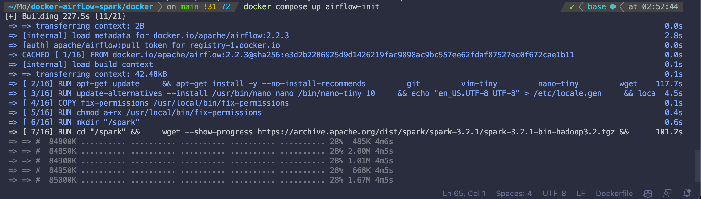
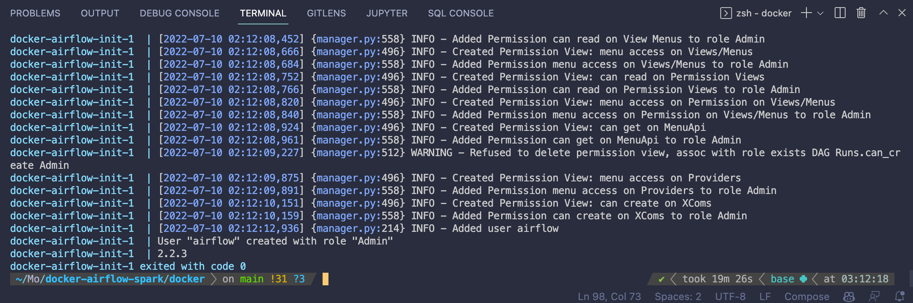
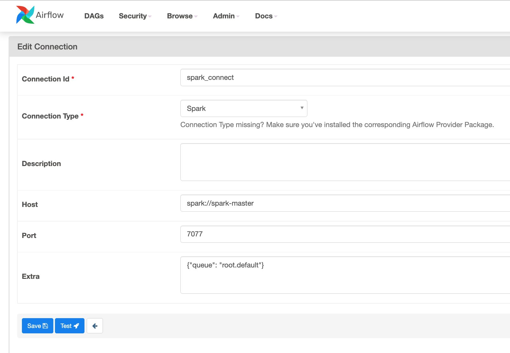
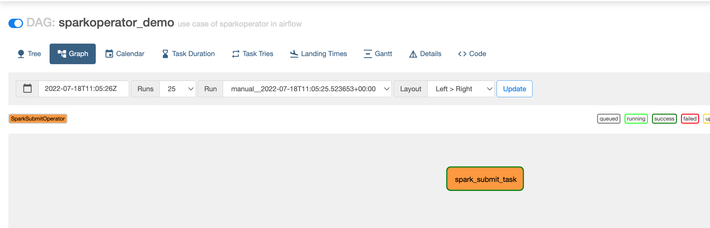
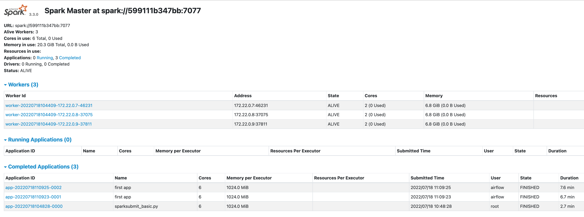
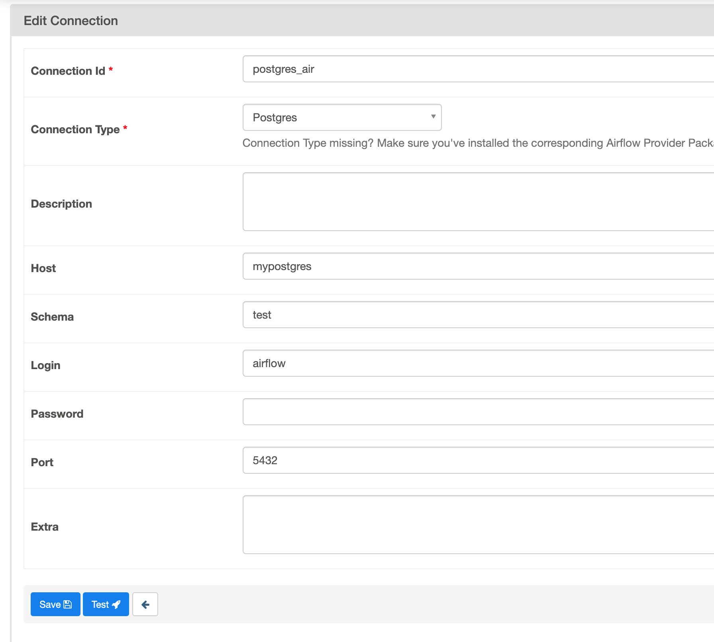
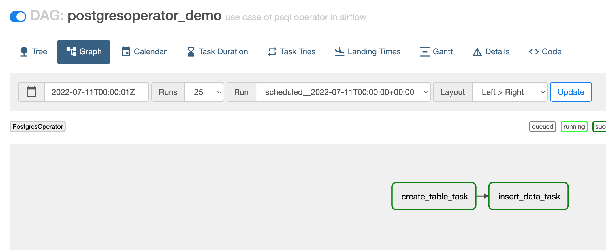
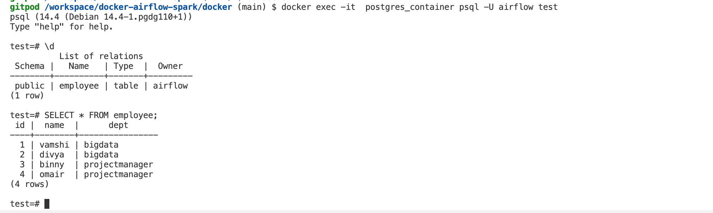
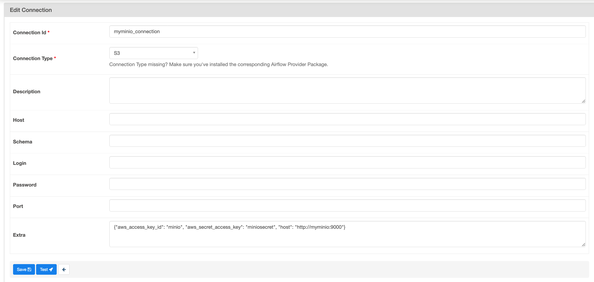
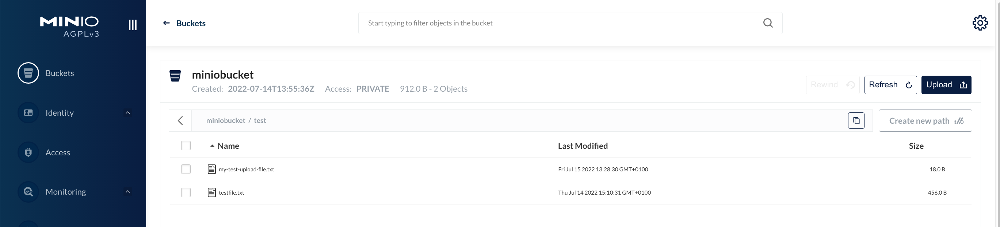

# Building an ELT Pipeline using Python, PostgreSQL, Spark and Airflow.
This post will detail how to build an ETL (Extract, Transform and Load) pipeline.

## Prerequisites
Definition:
- ETL is the general procedure of copying data from one or more sources into a destination system that represents the data differently from the source(s) or in a different context than the source(s). 
- ***Data Extraction*** involves extracting data from (one or more) homogeneous or heterogeneous sources; 
- ***Data Transformation*** processes data by data cleaning and transforming it into a proper storage format/structure for the purposes of querying and analysis; 
- Finally, ***Data Loading*** describes the insertion of data into the final target database such as an operational `data store` , `data mart` , `data lake` or a `data warehouse`. 

Before we head towards setting up Airflow, let's do a quick overvirew. 
-  [***Apache Airflow***](https://airflow.apache.org/docs/apache-airflow/stable/tutorial.html), is an open-source tool for orchestrating complex computational workflows and creating a data processing pipeline. Think of it as a fancy version of a <u>job scheduler or cron job</u>. 
-  A `workflow`  is a series of tasks that are executed in a specific order and we call them `DAGs`. 
-  A  `DAG` <u>(Directed Acyclic Graph)</u> is a graph that contains a set of tasks that are connected by dependencies or a graph with nodes connected via directed edges.

After creating the Dockerfile we can move towards running containers and starting up services. The `docker-compose.yaml` file below is a modified version of the official Airflow [yaml](https://airflow.apache.org/docs/apache-airflow/2.3.2/docker-compose.yaml) file. We have added the following changes:

  - Customized Airflow image that includes the installation of Python dependencies.
  - A custom network (`oasiscorp`) for bridging the containers, this will enable the containers to exist within a shared network.
  - Removes example DAGs.
  - Add our .env file to the Airflow container and,
  - Added hostnames for better IP recogntion. 

The docker-compose.yaml file when deployed will start a list of containers namely:

- `airflow-scheduler` - The scheduler monitors all tasks and DAGs, then triggers the task instances once their dependencies are complete.
- `airflow-webserver` - The webserver is available at http://localhost:8085.
- `airflow-worker`  - The worker that executes the tasks given by the scheduler.
- `airflow-init`  - The initialization service.
- `flower ` - The flower app for monitoring the environment. It is available at http:/localhost:5555.
- `postgres`  - The database.
- `redis`  - The redis-broker that forwards messages from scheduler to worker.


##############################################################################################################################
# Setting Up Airflow.
- Okay now that we got the basics of what Airflow and DAGs are, let’s set up Airflow. 
- First, we will need to create our custom Airflow Docker image. This image adds and installs a list of Python packages that we will need to run the ETL (Extract, Transform and Load) pipeline.

## Clone project

    $ git clone https://github.com/le-oasis/airflow-docker-spark

## Docker Images 
- For ease of use, before starting services, please pull the required docker images first.
- Run the following commands in order to pull the required docker images.

~~~
# Airflow Image 
docker pull apache/airflow:2.2.3
~~~
~~~
# Spark Master Image
docker pull bde2020/spark-master:3.3.0-hadoop3.3
~~~
~~~
# Spark Worker Image
docker pull bde2020/spark-worker:3.3.0-hadoop3.3
~~~
~~~
# Jupyter Notebook Image 
docker pull jupyter/pyspark-notebook:latest
~~~
~~~
# Postgres Image
docker pull postgres:latest
~~~
~~~
# Redis Image
docker pull redis:latest
~~~

## Dockerfile: Build the Image 
- `Dockerfile` that contians installations of `JAVA-JDK.v11`, `ApacheSpark.v3.3.0`, `Hadoop.v3`, & other dependencies built on top of `Airflow.v.2.2.3`.
- navigate to the `airflow-setup` directory, this is where the `Dockerfile` is located:
- `Dockerfile` is a `.dockerfile` file that contains the instructions to build the image.
- `docker` --> `airflow-setup` --> `Dockerfile`.
- It will take about ***20minutes*** to build, depending on yor internet speed. 
- Run the following command to build the image:

```
docker build --rm --force-rm -t docker-prunedge:latest . 
```
## Add the Environment File
- Now that we have our image, we need to add the environment file to the image.
- navigate back to: 👉🏼 : docker 
- This will enable the local host runtime and the container runtime to work with the same user.

~~~
echo -e "AIRFLOW_UID=$(id -u)\nAIRFLOW_GID=0" > .env
~~~

## Airflow Init.
- navigate back to: 👉🏼 : docker 

- You must run this `once` before you can get started. This is the initial bootstrap process. 
- You will see a bunch of debug logging during this process. You can scroll through this to see what the initalization process is doing. 
- Ultimately, this process is in charge of running the database setup work and migrations, bootstrapping and all initalization scripts. 
- This is essentially, everything you need to get up and running on Apache Airflow.
- Run the following command to run the init:

~~~
docker-compose up airflow-init
~~~

- output:



- This will create the Airflow database and the Airflow USER. 
- Once we have the Airflow database and the Airflow USER, we can start the Airflow services:



<br>

# Starting Services
- After running airflow-init & pulling the necessary images, you're ready to rock n roll. 
- Navigate to the `docker` directory:
- Run the following command to start the services:

~~~
docker compose  -f docker-compose.yaml  -f docker-compose.spark.yaml up -d
~~~

## Check Access

### Airflow: http://localhost:8085

Airflow UI Login: 
* username: airflow 
* password: airflow

### Spark: http://localhost:8080

* Spark Master & Workers.
### Jupyter: http://localhost:8888

* For Jupyter notebook, you must copy the URL with the token generated when the container is started and paste in your browser. 
* The URL with the token can be taken from container logs using:
 
```
docker logs $(docker ps -q --filter "ancestor=jupyter/pyspark-notebook:latest") 2>&1 | grep 'http://127.0.0.1' | tail -1

```
### Minio: http://localhost:9001

* username: minio 
* password: miniosecret
* Minio is the best server which is suited for storing unstructured data such as photos, videos, log files, backups, and container.
* This would serve as our Object Storage Service. 

### Postgres:
* localhost:5432
* Host: mypostgres
* Database: airflow
* User: airflow
* Password: airflow

- Please note, that a 'test' database was created during the init of Postgres. 

# Working with Containers

## Spark Submit 

- After you have started the services, you can run the Spark submit command to run a Spark job.
- Example: running the `basic.py` application. 
- This app simple runs a spark job that counts the number of words in a file.
- Run the following command to run the application:

```
docker exec -it spark-master /bin/bash
```
- This will take you to the bash shell of the spark container where you can run a Spark Submit job.
- Run the following command to start the application:


```
bash-5.0# spark/bin/spark-submit --master spark://spark-master:7077 /usr/local/spark/app/sparksubmit_basic.py  /usr/local/spark/resources/data/testfile.txt
```

## Architecture 


## Spark DAG
1. Configure a Spark Connection by Accessing the AirflowUI http://localhost:8085 and creating a connection.
2. Click on `Admin` ->  `Connections` in the top bar. 
3. Click on `Add a new record` and input the following details:

- Conn Id:  `spark_connect`  - This is the name of the connection.
- Conn Type: `Spark` - This is the type of connection.
- Host: `spark://spark-master` - This is the hostname of the Spark Master.
- Port: `7077`  - This is the port of the Spark Master.
- Extra: `{"queue": "root.default"}` - This is the name of the queue that the Spark job will be submitted to.

4. Save the connection settings. 




5. Run the `SparkOperatorDemo` DAG
6. After a couple minutes you should see the DAG run as successful. 



7. Check the DAG log for the result.


8. Check the Spark UI http://localhost:8080 for the result of our DAG & Spark submit via terminal:




## Postgres-Airflow Connection 
- In this scenario, we are going to schedule a dag file to create a table and insert data into it in PostgreSQL using the Postgres Operator.
- The DAG file we're executing is named 'postgresetl.py' in our DAGs folder. 
- Our DAG file will have two simple tasks of using SQL query to create_table & insert_data into our 'test' database. 
- After setting up our DAG, we need to configure the connection details in Airflow. 
- Open the service in your browser at http://localhost:8085
- Click on `Admin` ->  `Connections` in the top bar. 
- Let's create a new one for our purpose.

Click on Create and fill in the necessary details:

- `Conn Id`: postgres_air - the ID with which we can retrieve the connection details later on.
- `Conn Type`: Postgres - Select it from the dropdown menu.
- `Host`: mypostgres - Docker will resolve the hostname. {defined in the .yaml file}
- `Schema`: test - the database name (test database was created during init)
- `Login`: airflow - or whichever username you set in your docker-compose.yml file.
- `Password`: airflow - or whichever password you set in your docker-compose.yml file.
- `Port`: 5432 - the standard port for the database within the docker network.

Click on save: Creating the connection airflow to connect the Postgres DB as shown in below



- Head back to the Airflow UI, activate the DAG on the left and click on "Trigger DAG" on the right-hand side.
- DAG Succesful 




## Validate DAG

- A little sanity check to make sure the DAG is worked and our SQL tables have been populated.
- We're going to head into the postgres container 
- Navigate to the `docker` directory:
- Run the following command:


```
docker exec -it  postgres_container psql -U airflow test
```

- After gaining acces, we can run a SQL query to validate the data has been inserted.



- Congratulations! We are now able to schedule tasks to execute code on our database from Airflow!


## SparkSQL 
### Using RDBMS with Spark SQL and JDBC
- Connecting to a Relational Database Management System (RDBMS) from Spark requires two things, a JDBC compatible driver and the database properties. 
- Together Apache Spark can make it easy to work with data stored in external databases.
- to connect Spark to our Postgres DB we can run that using the Jupyter notebook container we made. 
- We can use the following command to connect to JupyterLab:
```
docker logs $(docker ps -q --filter "ancestor=jupyter/pyspark-notebook:latest") 2>&1 | grep 'http://127.0.0.1' | tail -1
```
- This will take you to the JupyterLab shell of the Jupyter notebook container where you can run a Spark SQL.
- Here we can read the data table from PostgreSQL and create the DataFrames.
- We can also write new data into Postgres via Jupyter Notebooks.
- We can also use the Spark SQL to query the data.

## Minio-Airflow  
### S3Bucket Object Storage (Minio)
- In this scenario, we are going to schedule a DAG to upload a text file to a Minio S3 bucket and then read the content of the .txt file.
- The DAG file we're executing is named 'hello-minio.py' in our DAGs folder.

* Our DAG file will have two simple tasks of using PythonOperator to upload a .txt to the S3Bucket and read the content of a file on the MiniO S3 bucket.
### Creating a S3 Bucket On The Minio WebUI

1. Go to the Minio webUI on http://localhost:9000

   * username: minio 
   * password: miniosecret
  
2. Click on bucket icon on the left-menu Bar marked red below the create a S3 Bucket with name `miniobucket`.


3. locally create a new file named minio_testfile.txt with the content "This is the content of a testfile from MinIO".

4. Select your bucket and click on Browse. Create a new directory called test by click on the icon marked in red.
5. Upload a .txt file (`testfile.txt`) from your local directory to the test folder in the S3 bucket below. 


### Minio-Airflow Connection

- After setting up our DAG, we need to configure the connection details in Airflow. 
- Open the service in your browser at http://localhost:8085 and click on `Admin` ->  `Connections` in the top bar. 


Click on Create and fill in the necessary details:

- `Conn Id`: myminio_connection - the ID with which we can retrieve the connection details later on.
- `Conn Type`: S3 - Select it from the dropdown menu.
- `Extras`:  

```
{"aws_access_key_id": "minio", "aws_secret_access_key": "miniosecret",  "host": "http://myminio:9000"}
```

- Should look like this. Click on Save.




- Head back to the Airflow UI, activate the DAG on the left & click on "Trigger DAG" on the right-hand side.


- Sanity Check to make sure the DAG is worked and our file has been uploaded to the S3 bucket.
- We're going to head into the Minio UI. 




- Great, our DAG was executed successfully and our file has been uploaded to the S3 bucket.

# FYI

## Adding New Users: Airflow

* airflow-init:
    * The initialization service. This sets up a database in the Airflow UI and creates users to login into the UI. 
    * For our UI:
    * Username: airflow
    * Password: airflow 
    * You can add a user via the airflow command line interface (cli) by typing the following command 

```
airflow users create -u <USERNAME> -f <FIRST> -l <LAST> -r <ROLE> -e <EMAIL>
```


## Postgres 

enter the Postgres Conatiner via CLI command :

```
docker exec -it  postgres_container bash 
```


## .env

Before starting Airflow for the first time, we need to prepare our environment. We need to add the Airflow USER to our .env file because some of the container’s directories that we mount, will not be owned by the root user. The directories are:

- ./dags - you can put your DAG files here.
- ./logs - contains logs from task execution and scheduler.
- ./plugins - you can put your custom plugins here.

```
mkdir -p ./dags ./logs ./plugins
chmod -R 777 ./dags ./logs ./plugins
echo -e "AIRFLOW_UID=$(id -u)" >> .env
echo -e "AIRFLOW_GID=0" >> .env

```

## Why do we need an ETL pipeline?

Assume we had a set of data that we wanted to use. However, this data is unclean, missing information, and inconsistent as with most data. One solution would be to have a program clean and transform this data so that:

- There is no missing information
- Data is consistent
- Data is fast to load into another program
- With smart devices, online communities, and E-Commerce, there is an abundance of raw, unfiltered data in today’s industry.
- However, most of it is squandered because it is difficult to interpret due to it being tangled. ETL pipelines are available to combat this by automating data collection and transformation so that analysts can use them for business insights.


## User defined network 
User-defined bridges provide automatic DNS resolution between containers, meaning one container will be able to “talk” to the other containers in the same network of docker containers. On a user-defined bridge network (like oasiscorp in our case), containers can resolve each other by name or alias. This is very practical as we won't have to manually look up and configure specific IP addresses.

## Official Docker Image Docs
https://airflow.apache.org/docs/apache-airflow/stable/start/docker.html
